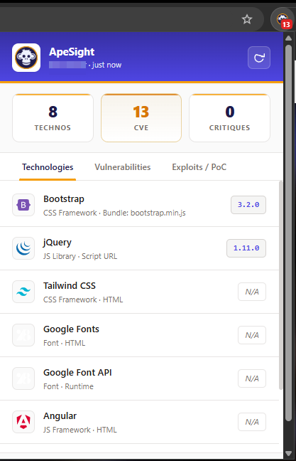

# ApeSight

Passive tech detection + CVE mapping browser extension.

It fingerprints whatever tech stack a website is running (frameworks, CMS, analytics, etc.) just from headers, DOM, cookies and JS globals — no active probing. Then it checks if any detected versions have known vulnerabilities using OSV and GitHub Advisories.



## What it does

- Detects 200+ technologies passively (headers, HTML, JS globals, cookies)
- Looks up CVEs in real-time for detected versions (OSV.dev + GHSA)
- Shows exploit/PoC links (GitHub, ExploitDB, Nuclei, PacketStorm, NVD)
- Caches results per origin (6h TTL) so the popup loads instantly
- Generates HTML security reports or JSON exports
- Shows CVE count as a badge on the extension icon

## Install

1. Clone the repo
```bash
git clone https://github.com/<your-username>/apesight.git
```

2. Go to `chrome://extensions/` in Chrome/Brave/Edge

3. Turn on **Developer mode** (top right)

4. Click **Load unpacked** → select the repo folder

5. Done, the ApeSight icon should show up in your toolbar

## Permissions

| Permission | Reason |
|---|---|
| `activeTab` | Read page DOM |
| `scripting` | Inject probe to detect JS globals |
| `storage` | Cache scan results |
| `webRequest` | Grab response headers passively |
| `webNavigation` | Auto-scan on page load |
| `cookies` | Tech detection (PHP sessions etc) |
| `tabs` | Get active tab URL |

Host permissions are needed for the APIs: OSV, GitHub, Simple Icons CDN.

## How to use

Just browse normally. ApeSight auto-scans every new origin. Click the icon to see what it found. Hit the refresh button to force a rescan. Export as JSON or HTML report.

## Dev

No build step, it's all vanilla JS. After making changes just go to `chrome://extensions/` and hit the reload button on the ApeSight card.

To debug:
- Background: click "service worker" on the extensions page
- Popup: right-click extension icon → Inspect popup

## Disclaimer / Responsible Use

ApeSight is provided for **educational, research, and defensive security purposes only**.

The extension performs **passive technology fingerprinting and vulnerability correlation** based on publicly available information. It does not actively exploit, attack, or attempt to gain unauthorized access to any system.

By using ApeSight, you acknowledge and agree that:

* You are solely responsible for how you use the software and any information it provides.
* The authors and contributors of ApeSight assume no liability for any misuse, damages, legal consequences, or actions resulting from the use of this project.
* Any testing, security assessment, or investigation must be conducted only against systems for which you have explicit authorization.
* Information about vulnerabilities, CVEs, exploits, proof-of-concepts, or security weaknesses is provided strictly for educational, research, awareness, and defensive security purposes.
* Users are responsible for ensuring compliance with all applicable laws, regulations, and organizational policies in their jurisdiction.

Use this project responsibly and ethically.

## Credits

- Icon: [Monkey](https://game-icons.net/) by game-icons.net (CC BY 3.0)
- Vuln data: [OSV.dev](https://osv.dev/), [GitHub Advisory Database](https://github.com/advisories)
- Tech icons: [Simple Icons](https://simpleicons.org/) (CC0)


